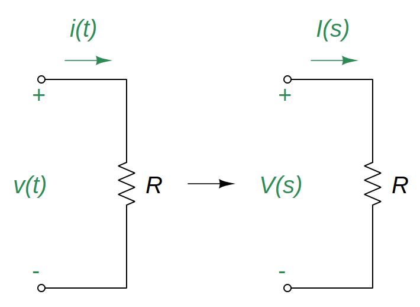
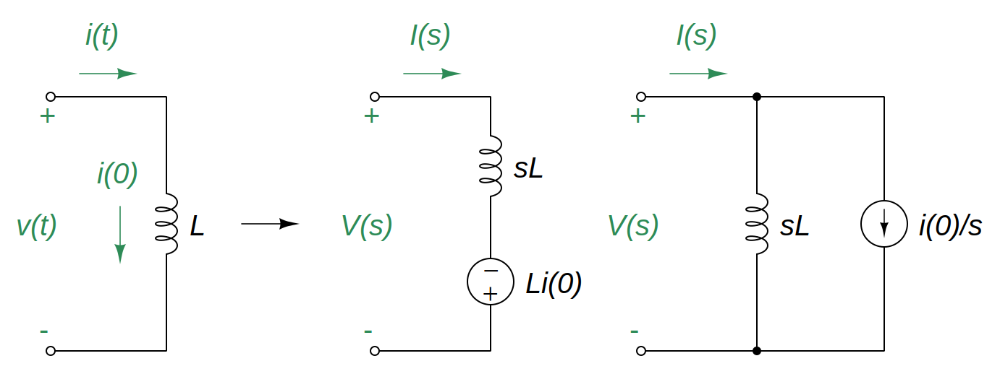
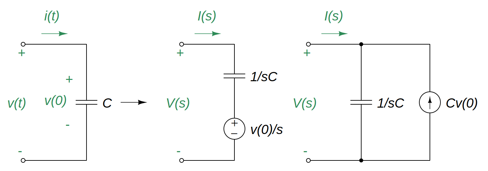

# Circuit Element Models in s-Domain

Steps in applying the [Laplace Transform](7628ec20.md):

- Transform the circuit from the time domain to *s*-domain.
- Solve the circuit using any circuit analysis techniques applied for DC Circuits.
- Take the [inverse Laplace transform](c9a77663.md) of the solution and thus obtain the solution in the time domain.

> The elegance of using the Laplace transform in circuit analysis lies in the automatic inclusion of the initial conditions in the transformation process, thus providing a [complete solution](3dd672e8.md).

With the *s*-domain equivalents, the Laplace transform can be used to solve [first-order](2abe1de7.md) and [second-order](29569029.md) circuits.

## For a resistor

> $\displaystyle v(t) = R\,i(t)$
>
> Taking the Laplace transform,
>
> $\boxed{V(s) = R\,I(s)}$

The [impedance](45a5fbef.md) $Z(s)$ of the [resistor](427b2567.md) is

> $\boxed{Z(s) = \frac{V(s)}{I(s)} = R}$

## For an inductor

> $\displaystyle v(t) = L\frac{di(t)}{dt}$
>
> Taking the [Laplace transform](7628ec20.md),
>
> $\displaystyle V(s) = L\left[s\,I(s) - i(0^-)\right] = sL\,I(s) - L\,i(0^-)$
>
> Since the [inductor](8be49ac8.md) current cannot change instantaneously, $i(0^-) = i(0^+) = i(0)$
>
> $\boxed{V(s) = sL\,I(s) - L\,i(0)}$
>
> $\boxed{I(s) = \frac{V(s)}{sL} + \frac{i(0)}{s}}$

The [impedance](45a5fbef.md) $Z(s)$ of the inductor at zero initial condition $i(0) = 0$ is

> $\boxed{Z(s) = \frac{V(s)}{I(s)} = sL}$

## For a capacitor

> $\displaystyle i(t) = C\frac{dv(t)}{dt}$
>
> Taking the [Laplace transform](7628ec20.md),
>
> $\displaystyle I(s) = C\left[s\,V(s) - v(0^-)\right] = sC\,V(s) - C\,v(0^-)$
>
> Since the [capacitor](48507115.md) voltage cannot change instantaneously, $v(0^-) = v(0^+) = v(0)$
>
> $\boxed{I(s) = sC\,V(s) - C\,v(0)}$
>
> $\boxed{V(s) = \frac{I(s)}{sC} + \frac{v(0)}{s}}$

The [impedance](45a5fbef.md) $Z(s)$ of the capacitor at zero initial condition $i(0) = 0$ is

> $\boxed{Z(s) = \frac{V(s)}{I(s)} = \frac{1}{sC}}$

