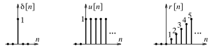

# Discrete Singularity Functions

The [discrete versions](03141daf.md) of the [unit impulse](b0a34c02.md) (or sample) $\delta[n]$, [unit step](58fcc503.md) $u[n]$, and [unit ramp](9e65fb42.md) $r[n]$ are defined as

> For integer index $n$,
>
> $\boxed{\delta[n] = \begin{cases}0\,, & n \neq 0 \\ 1\,, & n = 0\end{cases}}$
>
> $\boxed{u[n] = \begin{cases}0\,, & n < 0 \\ 1\,, & n \geq 0\end{cases}}$
>
> $\boxed{r[n] = n\,u[n] = \begin{cases}0\,, & n < 0 \\ n\,, & n \geq 0\end{cases}}$

The discrete impulse is just a ***unit sample*** at $n = 0$. It is completely free of the kind of ambiguities associated with [analog impulse](b0a34c02.md) $\delta(t)$ at $t = 0$. The discrete unit step $u[n]$ also has a well defined, unique value of $u[0] = 1$ (unlike its [analog counterpart](58fcc503.md)). The signal $x[n] = An\,u[n] = A\,r[n]$ describes a discrete ramp whose slope $A$ is given by $x[k] - x[k - 1]$, the difference between adjacent sample values.

## Properties of the Discrete Impulse

The product and sifting properties of discrete impulse are analogous to their [analog counterparts](b0a34c02.md).

### Product Property

The product of a signal $x[n]$ with the impulse $\delta[n - k]$ results in

> $\boxed{x[n]\,\delta[n - k] = x[k]\,\delta[n - k]}$
>
> This is just an impulse with strength $x[k]$.

### Sifting Property

The impulse $\delta[n]$ extracts the value $x[k]$ from signal $x[n]$ at the impulse location $n = k$.

> $\boxed{\sum_{n = -\infty}^{\infty} x[n]\,\delta[n - k] = x[k]}$

## Signal Representation by Impulses

Any [discrete signal](03141daf.md) $x[n]$ may be expressed as a sum of shifted impulses $\delta[n - k]$ whose strengths $x[k]$ correspond to the signal values at $n = k$.

> $\boxed{x[n] = \sum_{k = -\infty}^{\infty} x[k]\,\delta[n - k]}$

The discrete unit step $u[n]$ may be expressed as a train of shifted impulses $\delta[n - k]$ or as the [cumulative sum](1828b2ff.md) of discrete impulse $\delta[n]$.

> $\boxed{u[n] = \sum_{k = 0}^{\infty} \delta[n - k] = \sum_{k = -\infty}^{n} \delta[k]}$

The discrete ramp $r[n]$ may be expressed as a train of shifted impulses $\delta[n - k]$ or as the cumulative sum of discrete unit step $u[n]$.

> $\boxed{r[n] = \sum_{k = 0}^{\infty} k\,\delta[n - k] = \sum_{k = -\infty}^{n} u[k]}$
