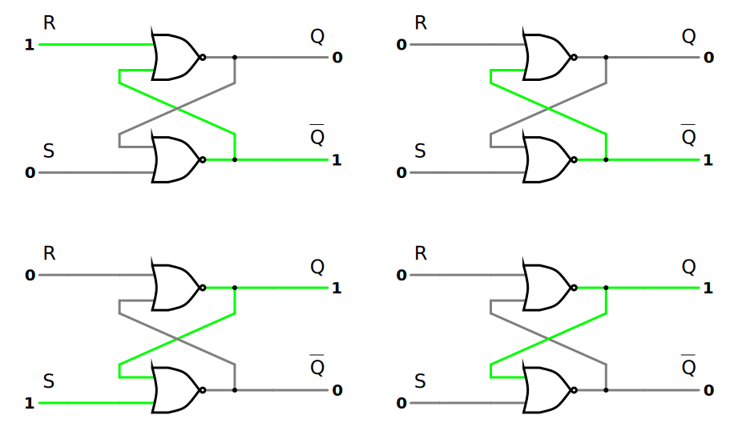

# Latches

A storage element in a digital circuit can maintain a binary state indefinitely (as long as power is delivered to the circuit), until directed by an input signal to switch states.

> Storage elements that operate with signal levels (rather than signal transitions) are referred to as ***latches***; those controlled by a clock transition are [flip-flops](16847013.md). Latches are said to be ***level-sensitive*** devices; flip-flops are ***edge-sensitive*** devices.

The two types of storage elements are related because ***latches*** are the basic circuits from which all [flip-flops](16847013.md) are constructed.

Although latches are useful for storing binary information and for the design of asynchronous [sequential circuits](8a2342ad.md), they are not practical for use as storage elements in synchronous sequential circuits.

## S-R NOR Latch

> An ***active-HIGH input*** $S$-$R$ (set-reset) ***latch*** is formed with two cross-coupled [NOR](afcc79cf.md) gates. When output $Q = 1$ and $\bar{Q} = 0$, the latch is in the ***set state***. When output $Q = 0$ and $\bar{Q} = 1$, the latch is in the ***reset state***.

Outputs $Q$ and $\bar{Q}$ are normally the [complement](3d005f51.md) of each other. However, when both inputs are equal to $1$ at the same time, a condition in which both outputs are equal to $0$ occurs. If both inputs are then switched to $0$ simultaneously, the device will enter an unpredictable or undefined state.

| $S$ | $R$ | $Q$ | $\bar{Q}$ | $\textrm{Comments}$ |
| :- | :- | :- | :- | :- |
| $0$ | $1$ | $0$ | $1$ | $\textit{reset state}$ |
| $0$ | $0$ | $0$ | $1$ | $\textit{hold reset state }(\textrm{after }S = 0,\,R = 1)$ |
| $1$ | $0$ | $1$ | $0$ | $\textit{set state}$ |
| $0$ | $0$ | $1$ | $0$ | $\textit{hold set state }(\textrm{after }S = 1,\,R = 0)$ |
| $1$ | $1$ | $0$ | $0$ | $\textit{invalid state }(\textrm{forbidden})$ |

Under normal conditions, both inputs of the latch remain at $0$ unless the state has to be changed. The application of a momentary $1$ to (only) the $S$ input causes the latch to go to the set state. The $S$ input must go back to $0$ before any other changes take place, in order to avoid the occurence of an undefined next state that results from the forbidden input condition. Removing the active input from $S$ leaves the circuit in the same state. After both inputs return to $0$, it is then possible to shift to the reset state by momentarily applying a $1$ to (only) the $R$ input. Removing the active input from $R$ leaves the circuit in the same state. Thus, when both inputs $S$ and $R$ are equal to $0$, the latch can be in either the set or the reset state, depending on which input was most recently a $1$.

### S-R NOR Latch Complement

The [De Morgan](3d005f51.md) (complement) equivalent of $S$-$R$ [NOR](afcc79cf.md) latch.

## S'-R' NAND Latch

> An ***active-LOW input*** $\bar{S}$-$\bar{R}$ (set-reset) ***latch*** is formed with two cross-coupled [NAND](afcc79cf.md) gates. When output $Q = 1$ and $\bar{Q} = 0$, the latch is in the ***set state***. When output $Q = 0$ and $\bar{Q} = 1$, the latch is in the ***reset state***.

Outputs $Q$ and $\bar{Q}$ are normally the [complement](3d005f51.md) of each other. However, when both inputs are equal to $0$ at the same time, a condition in which both outputs are equal to $1$ occurs. If both inputs are then switched to $1$ simultaneously, the device will enter an unpredictable or undefined state.

| $\bar{S}$ | $\bar{R}$ | $Q$ | $\bar{Q}$ | $\textrm{Comments}$ |
| :- | :- | :- | :- | :- |
| $1$ | $0$ | $0$ | $1$ | $\textit{reset state}$ |
| $1$ | $1$ | $0$ | $1$ | $\textit{hold reset state }(\textrm{after }\bar{S} = 1,\,\bar{R} = 0)$ |
| $0$ | $1$ | $1$ | $0$ | $\textit{set state}$ |
| $1$ | $1$ | $1$ | $0$ | $\textit{hold set state }(\textrm{after }\bar{S} = 0,\,\bar{R} = 1)$ |
| $0$ | $0$ | $1$ | $1$ | $\textit{invalid state }(\textrm{forbidden})$ |

Under normal conditions, both inputs of the latch remain at $1$ unless the state has to be changed. The application of a momentary $0$ to (only) the $\bar{S}$ input causes the latch to go to the set state. The $\bar{S}$ input must go back to $1$ before any other changes take place, in order to avoid the occurence of an undefined next state that results from the forbidden input condition. Removing the active input from $\bar{S}$ leaves the circuit in the same state. After both inputs return to $1$, it is then possible to shift to the reset state by momentarily applying a $0$ to (only) the $\bar{R}$ input. Removing the active input from $\bar{R}$ leaves the circuit in the same state. Thus, when both inputs $\bar{S}$ and $\bar{R}$ are equal to $1$, the latch can be in either the set or the reset state, depending on which input was most recently a $0$.

### S'-R' NAND Latch Complement

The [De Morgan](3d005f51.md) (complement) equivalent of $\bar{S}$-$\bar{R}$ [NAND](afcc79cf.md) latch.

## Gated S-R Latch

The operation of the basic $S$-$R$ latch can be modified by providing an additional input signal that determines (controls) when the state of the latch can be changed by determining whether $S$ and $R$ can affect the circuit.

| $EN$ | $S$ | $R$ | $Q$ | $\bar{Q}$ | $\textrm{Comments}$ |
| :- | :- | :- | :- | :- | :- |
| $0$ | $\textrm{X}$ | $\textrm{X}$ | $Q_\textrm{previous}$ | $\bar{Q}_\textrm{previous}$ | $\textit{hold previous state }(\textrm{no change})$ |
| $1$ | $0$ | $1$ | $0$ | $1$ | $\textit{reset state}$ |
| $1$ | $0$ | $0$ | $0$ | $1$ | $\textit{hold reset state }(\textrm{after }EN = 1,\,S = 0,\,R = 1)$ |
| $1$ | $1$ | $0$ | $1$ | $0$ | $\textit{set state}$ |
| $1$ | $0$ | $0$ | $1$ | $0$ | $\textit{hold set state }(\textrm{after }EN = 1,\,S = 1,\,R = 0)$ |
| $1$ | $1$ | $1$ | $1$ | $1$ | $\textit{invalid state }(\textrm{forbidden})$ |

It consists of the $\bar{S}$-$\bar{R}$ latch and two additional [NAND](afcc79cf.md) gates. The control input $EN$ acts as an ***enable signal*** for the other two inputs. When the enable input $EN$ goes to $1$, information from the $S$ or $R$ input is allowed to affect the latch. The control input disables the circuit by applying $0$ to $EN$, so that the state of the output does not change regardless of the values of $S$ and $R$. Moreover, when $EN = 1$ and both the $S$ and $R$ inputs are equal to $0$, the state of the circuit does not change.

An indeterminate condition occurs when all three inputs are equal to $1$. This condition places $0$'s on both inputs of the $\bar{S}$-$\bar{R}$ latch, which puts it in the undefined state. When the enable input goes back to $0$, one cannot conclusively determine the next state, because it depends on whether the $S$ or $R$ input goes to $0$ first.

## D Latch (Transparent Latch)

One way to eliminate the undesirable condition of the indeterminate state in the $S$-$R$ latch is to ensure that inputs $S$ and $R$ are never equal to $1$ at the same time.

This latch has only two inputs: $D$ (data) and $EN$ (enable). The $D$ input goes directly to the $S$ input, and its complement is applied to the $R$ input.

| $EN$ | $D$ | $Q$ | $\bar{Q}$ | $\textrm{Comments}$ |
| :- | :- | :- | :- | :- |
| $0$ | $\textrm{X}$ | $Q_\textrm{previous}$ | $\bar{Q}_\textrm{previous}$ | $\textit{hold previous state }(\textrm{no change})$ |
| $1$ | $0$ | $0$ | $1$ | $\textit{reset state}$ |
| $1$ | $1$ | $1$ | $0$ | $\textit{set state}$ |

As long as the enable input is at $0$, the cross-coupled $\bar{S}$-$\bar{R}$ latch has both inputs at the $1$ level and the circuit cannot change state regardless of the value of $D$. The $D$ input is sampled when $EN = 1$. If $D = 1$, the $Q$ output goes to $1$, placing the circuit in the set state. If $D = 0$, output $Q$ goes to $0$, placing the circuit in the reset state.

> The binary information present at the data input of the $D$ ***latch*** is transferred to the $Q$ output when the enable input is asserted.

The output follows changes in the data input as long as the enable input is asserted. When the enable input signal is de-asserted, the binary information that was present at the data input at the time the transition of enable occured is retained (stored) at the $Q$ output until the enable input is asserted again.

## Graphical Symbol for Latches

A latch is designated by a rectangular block with inputs on the left and outputs on the right. One output designates the normal output, and the other (with the bubble designation) designates the complement output.

The graphical symbol for the $S$-$R$ NOR latch has inputs $S$ and $R$ indicated inside the block. In the case of a $\bar{S}$-$\bar{R}$ NAND latch, bubbles are added to the inputs to indicate that setting and resetting occur with a logic-$0$ signal. The graphical symbol for the $D$ latch has inputs $D$ and $En$ indicated inside the block.

