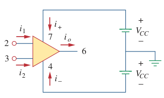

# Operational Amplifier (Op Amp)

The ***op amp*** is an electronic unit that behaves like a voltage-controlled voltage source. An op amp may also be regarded as a voltage amplifier with very high gain. It can also be used in making a voltage- or current-controlled current source.

> An ***op amp*** is an active circuit element designed to perform mathematical operations of addition, subtraction, multiplication, division, differentiation, and integration.

The five important terminals:

- Inverting input, pin 2.
- Non-inverting input, pin 3.
- Output, pin 6.
- Positive power supply $V^{+}$, pin 7.
- Negative power supply $V^{-}$, pin 4.

> An input applied to the non-inverting terminal will appear with the same polarity at the output, while an input applied to the inverting terminal will appear inverted at the output.

## Powering the Op Amp

> $\displaystyle i_{o} = i_{1} + i_{2} + i_{+} + i_{-}$

The output voltage $v_{o}$ of op amp is dependent on and is limited by the supply voltage $V_{CC}$. Op amp can operate in three modes, depending on the differential input voltage $v_{d}$.

1. Positive saturation, $v_{o} = V_{CC}$.
2. Linear region, $-V_{CC} \le v_{o} \le V_{CC}$.
3. Negative saturation, $v_{o} = -V_{CC}$.

## Applications

The ***op amp*** is a fundamental building block in modern electronic instrumentation. It is used extensively in many devices, along with resistors and other passive elements. Its numerous practical applications include *instrumentation amplifiers*, *digital-to-analog converters*, *[analog computers](594a71cd.md)*, *level shifters*, *filters*, *calibration circuits*, *[inverters](d6dfa54d.md)*, *[summers](7104d169.md)*, *[integrators](99d23403.md)*, *[differentiators](4c10ed9c.md)*, *[subtractors](49951bf2.md)*, *logarithmic amplifiers*, *comparators*, *gyrators*, *[oscillators](ee0de5b3.md)*, *rectifiers*, *regulators*, *voltage-to-current converters*, *current-to-voltage converters*, and clippers.
