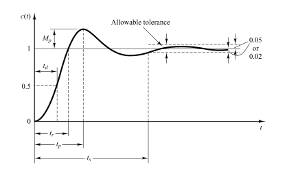

# Time Response

The ***time response*** of a [control system](5ab15bd7.md) consists of two parts: the *transient response* and the *steady-state response*.

After applying input $r(t)$ to the control system, the output $c(t)$ takes certain time to reach steady state. So, the output will be in transient state till it goes to a steady state.

> ***Transient response*** describes the system's behavior as it transitions from its initial state to its final state, immediately following a change or disturbance.

> ***Steady-state response*** characterizes how the system output behaves as time approaches infinity, once the transient effects have faded away and the system has reached a stable condition.

Thus, the system response $c(t)$ may be written as

> $\boxed{\displaystyle c(t) = c_{tr}(t) + c_{ss}(t)}$
>
> where $c_{tr}$ is the transient response, and $c_{ss}$ is the steady-state response.

See: [Complete Response of a Circuit](3dd672e8.md)

## Transient Response Specifications

### Delay Time

> The ***delay time*** $(t_d)$ is the time required for the response to reach half the final value the very first time.

### Rise Time

> The ***rise time*** $(t_r)$ is the time required for the response to rise from $10\%$ to $90\%$, $5\%$ to $95\%$, or $0\%$ to $100\%$ of its final value.

### Peak Time

> The ***peak time*** $(t_p)$ is the time required for the response to reach the first peak of the overshoot.

### Overshoot

> The ***overshoot*** is when a signal exceeds its target. It is often associated with ***ringing*** (oscillation of a signal). The ***undershoot*** is the same phenomenon in the opposite direction.

> The ***maximum overshoot*** $(M_{p})$ is the amount that the waveform overshoots the steady-state (final) value, or value at the peak time $(t_p)$.

The amount of the maximum (percent) overshoot directly indicates the [relative stability](cbcacf19.md) of the system.

### Settling Time

> The ***settling time*** $(t_s)$ is the time required for the response curve to reach and stay within a range about the final value of size specified by absolute percentage of the final value (usually $2\%$ or $5\%$ percentage error criterion).

The settling time $(t_s)$ is related to the largest [time constant](50d3bdaf.md) $(\tau)$ of the control system.
