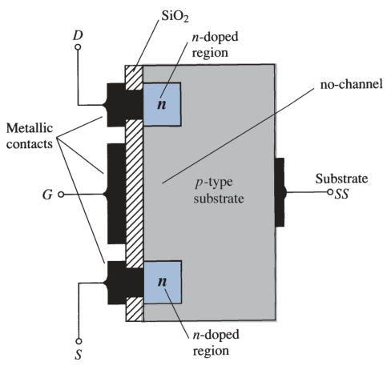
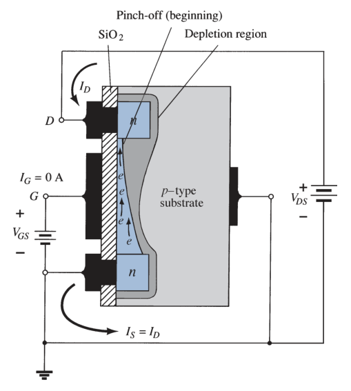

# Enhancement-type MOSFET

Although there are some similarities in construction and mode of operation between [depletion-type](1fbb3c8c.md) and enhancement-type MOSFETs, the characteristics of the enhancement-type MOSFET are quite different. The transfer curve is not defined by Shockley's equation, and the drain current is now cut off until the gate-to-source voltage reaches a specific magnitude.

## Basic Construction

The construction of an enhancement-type MOSFET is quite similar to that of the [depletion-type](1fbb3c8c.md) MOSFET, except for the absence of a channel between the drain and source terminals.

The basic construction of the *n*-channel enhancement-type MOSFET.

## Basic Operation and Characteristics

If $V_{GS} = 0\ V$ and voltage applied between the drain and the source of the *n*-channel enhancement-type MOSFET, the absence of an *n*-channel will result in a current of effectively $0\ A$, which is quite different from the [depletion-type](1fbb3c8c.md) MOSFET and [JFET](4023da85.md), where $I_D = I_{DSS}$.

Both $V_{DS}$ and $V_{GS}$ have been set at some positive voltage greater than $0\ V$, establishing the drain and the gate at a positive potential with respect to the source.

As $V_{GS}$ increases in magnitude, the concentration of electrons near the $SiO_2$ (insulating layer) surface increases until eventually the induced *n*-type region can support a measurable flow between drain and source. The level of $V_{GS}$ that results in the significant increase in drain current is called the ***threshold voltage*** $V_T$. On specification sheets it is referred to as $V_{GS(Th)}$.

As $V_{GS}$ is increased beyond the threshold level, the density of free carriers in the induced channel will increase, resulting in an increased level of drain current. However, if we hold $V_{GS}$ constant and increase the level of $V_{DS}$, the drain current $I_D$ will eventually reach a saturation level as occurred for the [JFET](4023da85.md) and [depletion-type](1fbb3c8c.md) MOSFET. The leveling off of $I_D$ is due to a pinching-off process depicted by the narrower channel at the drain end of the induced channel.

Applying Kirchhoff's voltage law (KVL) to the terminal voltages of the MOSFET.

$$\boxed{V_{DG} = V_{DS} - V_{GS}}$$

If $V_{GS}$ is held fixed at some value and $V_{DS}$ is increased, the voltage $V_{DG}$ will increase and the gate will become less and less positive with respect to the drain. This reduction in gate-to-drain voltage will in turn reduce the attractive forces for free carriers (electrons) in this region of the induced channel, causing a reduction in the effective channel width.

The saturation level for $V_{DS}$ is related to the level of applied $V_{GS}$ by

$$\boxed{V_{{DS}_{sat}} = V_{GS} - V_T}$$

For a fixed value of $V_T$, the higher the level of $V_{GS}$, the greater is the saturation level for $V_{DS}$.

> For values of $V_{GS}$ less than the threshold voltage, the drain current of an enhancement-type MOSFET is $0\ mA$.

For levels of $V_{GS} > V_T$, the drain current $I_D$ is related to the applied gate-to-source voltage $V_{GS}$ by

$$\boxed{I_D = k \left( V_{GS} - V_T\right) ^ 2}$$

$$\boxed{k = \frac{I_{D(on)}}{\left( V_{GS(on)} - V_T \right) ^ 2}}$$

The $k$ term is a constant that is a function of the construction of the device, where $I_{D(on)}$ and $V_{GS(on)}$ are the values for each at a particular point on the characteristics of the device.

## P-channel Enhancement-type MOSFET

The construction of a *p*-channel enhancement-type MOSFET is exactly the reverse of the *n*-channel enhancement-type MOSFET. The terminals remain as identified, but all the voltage polarities and the current directions are reversed.

Equations used in *n*-channel enhancement-type MOSFET are equally applicable to *p*-channel enhancement-type MOSFET.

## Symbols

- *n*-channel enhancement-type MOSFET

	

- *p*-channel enhancement-type MOSFET

	

## Biasing

See [FET biasing](de2d417f.md) for the general analysis of all FET amplifiers.

### DC Analysis

- [Feedback biasing arrangement](d31b939f.md)
- [Voltage-divider biasing arrangement](1ce92e9d.md)

### AC Analysis

For Enhancement-type MOSFET, the relationship between output current and controlling variable is defined by

> $\boxed{I_D = k\left(V_{GS} - V_{GS(Th)}\right)^2}$
>
> $\boxed{k = \frac{I_{D(on)}}{\left( V_{GS(on)} - V_{GS(Th)} \right) ^ 2}}$

Transconductance $g_m$

> $\displaystyle g_m = \frac{dI_D}{dV_{GS}} = \frac{d}{dV_{GS}}\left[k\left(V_{GS} - V_{GS(Th)}\right)^2\right]$
>
> $\displaystyle g_m = k\,\frac{d}{dV_{GS}}\left(V_{GS} - V_{GS(Th)}\right)^2 = 2k\left(V_{GS} - V_{GS(Th)}\right)\,\frac{d}{dV_{GS}}\left(V_{GS} - V_{GS(Th)}\right)$
>
> $\boxed{g_m = 2k\left(V_{GS} - V_{GS(Th)}\right)}$

In every other aspect, the AC analysis is the same as that employed for [JFET](4023da85.md)s or [D-MOSFET](1fbb3c8c.md)s.

- [Drain-feedback configuration](414b57c3.md)
- [Voltage-divider configuration](151ecd03.md)
