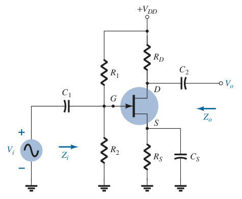
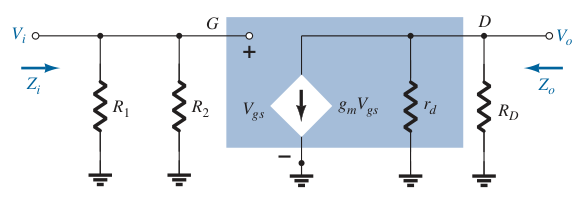

# JFET Voltage-Divider Configuration (AC Analysis)

Determine $g_m$ and $r_d$ from the specification sheets.

> $\boxed{g_m = g_{fs} = y_{fs}}$
>
> $\boxed{r_d = \frac{1}{g_{os}} = \frac{1}{y_{os}}}$

If $g_{fs}$ or $y_{fs}$ is not available, determine $g_m$ using the values of $V_{GS}$ and $I_D$ from the [DC biasing arrangement](76d5df5d.md).

> $\boxed{g_m = \frac{2I_{DSS}}{\left|V_P\right|}\left(1 - \frac{V_{GS}}{V_P}\right) = \frac{2I_{DSS}}{\left|V_P\right|} \sqrt{\frac{I_D}{I_{DSS}}}}$

Once the levels of $g_m$ and $r_d$ are determined, the AC equivalent model can be substituted between the appropriate terminals. Set all capacitors and DC sources to short-circuit equivalent.

Input impedance $Z_i$

> $\boxed{Z_i = R_1 \parallel R_2}$

Output impedance $Z_o$ (set $V_i = 0\,V$)

> $\boxed{Z_o = r_d \parallel R_D}$

Voltage gain $A_v$

> $\displaystyle V_o = -g_m V_{gs} \left(r_d \parallel R_D\right)$
> $\displaystyle V_{gs} = V_i$
> $\displaystyle V_o = -g_m V_i \left(r_d \parallel R_D\right)$
>
> $\boxed{A_v = \frac{V_o}{V_i} = -g_m\left(r_d \parallel R_D\right)}$

Note that the equations for $Z_o$ and $A_v$ are the same as obtained for the [fixed-bias](a3c8ef03.md) and [self-bias](4aafd311.md) (with bypassed $R_S$) configurations. The only difference is the equation for $Z_i$, which is now sensitive to the parallel combination of $R_1$ and $R_2$.
