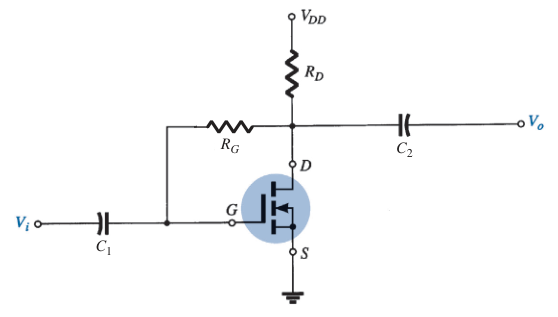
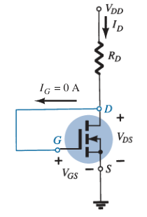

# E-MOSFET Feedback Biasing Arrangement (DC Analysis)

For the DC analysis, the capacitors can be replaced by *open circuits*.

Since $I_G \simeq 0\ A$ and $I_D = I_S$

> $\boxed{V_{DS} = V_D = V_{GS} = V_G}$
>
> $-V_{DD} + I_D R_D + V_{DS} = 0$
>
> $\boxed{V_{GS} = V_{DS} = V_{DD} - I_D R_D}$

For $V_{GS} > V_{GS(Th)}$, substitute $V_{GS}$ to the transfer curve equation:

> $\boxed{k = \frac{I_{D(on)}}{\left( V_{GS(on)} - V_{GS(Th)} \right) ^ 2}}$
>
> $I_D = k \left( V_{GS} - V_{GS(Th)} \right) ^ 2$
>
> $\boxed{I_D = k \left( V_{DD} - I_D R_D - V_{GS(Th)} \right) ^ 2}$
>
> $\boxed{V_S = 0\ V}$
