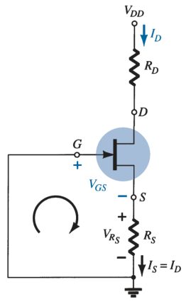

# JFET Self-Bias Configuration (DC Analysis)

For the DC analysis, the capacitors can be replaced by *open circuits*.

Since $I_G \simeq 0\ A$ and $I_D = I_S$

> $\boxed{V_G = 0\ V}$
>
> $V_{GS} + V_{R_S} = 0$
> $V_{GS} = - I_S R_S$
>
> $\boxed{V_{GS} = - I_D R_S}$

Substituting $V_{GS}$ to Shockley's equation:

> $I_D = I_{DSS} \left( 1 - V_{GS} / V_P \right) ^ 2$
>
> $\boxed{I_D = I_{DSS} \left( 1 + \frac{I_D R_S}{V_P} \right) ^ 2}$
>
> $-V_{DD} + I_D R_D + V_{DS} + I_S R_S = 0$
> $-V_{DD} + V_{DS} + I_D \left( R_D + R_S \right) = 0$
>
> $\boxed{V_{DS} = V_{DD} - I_D \left( R_D + R_S \right)}$
>
> $\boxed{V_D = V_{DD} - I_D R_D}$
>
> $\boxed{V_S = I_D R_S}$
