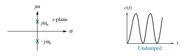
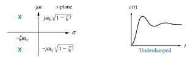
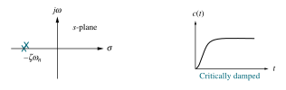
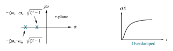

# Time Response of Second-Order System

The [closed-loop](5ab15bd7.md) [transfer function](6f158a97.md) of the [second-order system](53f31a4e.md) is given by

> $\boxed{\displaystyle \mathrm{CLTF} = G(s) = \frac{C(s)}{R(s)} = \frac{\omega_{n}^2}{s^2 + 2\zeta\omega_{n}s + \omega_{n}^2}}$
>
> where $\zeta$ is the ***damping ratio***; and $\omega_{n}$ is the ***undamped natural frequency***, expressed in radians per second (rad/s).

The damping case is determined by the [damping ratio](a61ce3dd.md) $\zeta$ from the poles.

> The closed-loop [poles](6f158a97.md) of the second-order [transfer function](6f158a97.md) $G(s)$ are
>
> $\boxed{\displaystyle s = -\zeta\omega_{n} \pm \omega_{n}\sqrt{1 - \zeta^2} = -\sigma_{d} \pm j\,\omega_{d}}$
>
> where $(\alpha = \sigma_{d})$ is the ***damping attenutation***, expressed in nepers per second (Np/s); and $\omega_{d}$ is the ***damped natural frequency***, expressed in radians per second (rad/s).

See: [Second-Order Circuits](29569029.md)

## Step Response

Using the [unit-step](58fcc503.md) signal $u(t)$ as an input $r(t)$ to the second-order system,

> For a unit-step signal, $r(t) = u(t)$, the [Laplace transform](7628ec20.md) of $r(t)$ is
>
> $\boxed{\displaystyle R(s) = \frac{1}{s}}$

Then, the ***unit step response*** can be found using $C(s) = R(s)\,G(s)$, followed by the [inverse Laplace transform](c9a77663.md).

> $\boxed{\displaystyle C(s) = \frac{\omega_{n}^2}{s\left(s^2 + 2\zeta\omega_{n}s + \omega_{n}^2\right)}}$

### Undamped Case $(\zeta = 0)$

The two poles of $G(s)$ are imaginary, $(s = \pm j\omega_{n})$.

> Substituting $(\zeta = 0)$ to the transfer function $C(s)$,
>
> $\displaystyle C(s) = \frac{\omega_{n}^2}{s\left(s^2 + \omega_{n}^2\right)} = \frac{1}{s} - \frac{s}{s^2 + \omega_{n}^2}$
>
> Apply the [inverse Laplace transform](c9a77663.md),
>
> $\boxed{\displaystyle c(t) = \left[1 - \cos(\omega_{n}t)\right]\,u(t)}$

So, for undamped case $(\zeta = 0)$, the [transient response](c225601a.md) does not die out, and the unit step response will be a continuous time signal with constant amplitude and frequency.

#### Transient Parameters

- Settling Time $(T_s)$

  > Since the [transient response](c225601a.md) does not die out,
  >
  > $\boxed{\displaystyle T_{s} = 0}$

### Underdamped Case $(0 < \zeta < 1)$

#### Transient Parameters

### Critically Damped Case $(\zeta = 1)$

#### Transient Parameters

### Overdamped Case $(\zeta > 1)$

#### Transient Parameters

## Impulse Response
