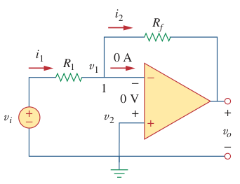

# Inverting Amplifier (Op Amp)

> An ***inverting amplifier*** reverses the polarity of the input signal while amplifying it.

A key feature of the inverting amplifier is that both the input signal and the feedback are applied at the inverting terminal of the [op amp](bd63e87b.md).

> Applying KCL at node 1,
>
> $\displaystyle i_1 = i_2 \to \frac{v_i - v_1}{R_1} = \frac{v_1 - v_o}{R_f}$
>
> But $v_1 = v_2 = 0$ for an [ideal op amp](fc89a5a0.md), since the non-inverting terminal is grounded. Hence,
>
> $\displaystyle \frac{v_i}{R_1} = -\frac{v_o}{R_f}$
>
> $\boxed{v_o = -\frac{R_f}{R_1} v_i}$
>
> [Closed-loop voltage gain](6e0eb346.md) $A_v$
>
> $\boxed{A_v = \frac{v_o}{v_i} = -\frac{R_f}{R_1}}$
