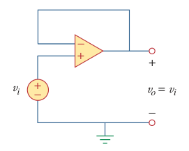
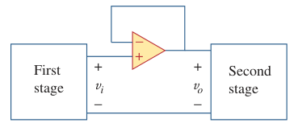

# Unity Follower (Op Amp)

> The ***unity follower*** (or *voltage follower*) is an [op amp](bd63e87b.md) circuit that provides a gain of unity (1) with no polarity or phase reversal.

> For an [ideal op amp](fc89a5a0.md),
>
> $\boxed{v_o = v_i}$
>
> [Closed-loop voltage gain](6e0eb346.md) $A_v$
>
> $\boxed{A_v = \frac{v_o}{v_i} = 1}$

Such a circuit has a very high input impedance and is therefore useful as an *intermediate-stage (or buffer) amplifier* to isolate one circuit from another. The voltage follower minimizes interaction between two stages and eliminates interstage loading.

