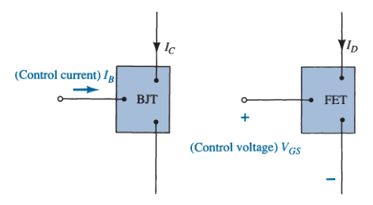
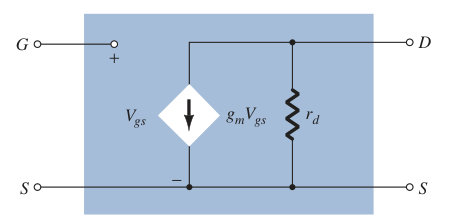

# Field-Effect Transistor (FET)

The ***field-effect transistor*** (FET) is a three-terminal device used for a variety of applications that match, to a large extent, those of the ***bipolar-junction transistor*** (BJT).

> The *BJT transistor* is a current-controlled device (current-controlled current source), whereas the *FET transistor* is a voltage-controlled device (voltage-controlled current source).

Just are there are *npn* and *pnp* bipolar transistors, there are *n-channel* and *p-channel* field-effect transistors. The BJT transistor is a *bipolar* device, the prefix *bi* indicates that the conduction level is a function of two charge carriers (electrons and holes). The FET is a *unipolar* device depending solely on either electron (*n-channel*) or hole (*p-channel*) conduction.

> One of the most important characteristics of the FET is its *high input impedance*.

> Typical ac voltage gains for BJT amplifiers are a great deal more than for FETs.

> FETs are more temperature stable than BJTs, and FETs are usually smaller than BJTs, making them particularly useful in integrated-circuit (IC) chips.

Types of FET:

1. *[Junction field-effect transistor](4023da85.md)* (JFET)
2. *[Metal-oxide-semiconductor field-effect transistor](ebb52c96.md)* (MOSFET)
3. *[Metal-semiconductor field-effect transistor](0437da6d.md)* (MESFET)

## Biasing

### DC Analysis

The general relationships that can be applied to the DC analysis of all FET amplifiers are:

$$\boxed{I_G \simeq 0\ A}$$

$$\boxed{I_D = I_S}$$

For JFETs and depletion-type MOSFETs and MESFETs, *Shockley's equation* is applied to relate the input and output quantities:

$$\boxed{I_D = I_{DSS} \left( 1 - \frac{V_{GS}}{V_P} \right) ^ 2}$$

For enhancement-type MOSFETs and MESFETs, the following equation is applicable:

$$\boxed{I_D = k \left( V_{GS} - V_T \right) ^ 2}$$

### AC Analysis

#### JFET Small-Signal Model

The ac analysis of a [JFET](4023da85.md) configuration requires that a small-signal ac model for the JFET be developed.

> The gate-to-source voltage controls the drain-to-source (channel) current of a [JFET](4023da85.md).

The *change* in drain current that will result from a *change* in gate-to-source voltage can be determined using the ***transconductance factor*** $g_m$.

> $\boxed{\Delta I_D = g_m\,\Delta V_{GS}}$
>
> $\boxed{g_m = \frac{\Delta I_D}{\Delta V_{GS}}}$

If we take the derivative of $I_D$ with respect to $V_{GS}$ using Shockley's equation, we can derive an equation for $g_m$.

> $\displaystyle I_D = I_{DSS}\,\left(1 - \frac{V_{GS}}{V_P}\right)^2$
>
> $\displaystyle \sqrt{\frac{I_D}{I_{DSS}}} = 1 - \frac{V_{GS}}{V_P}$
>
> $\displaystyle g_m = \frac{dI_D}{dV_{GS}} = \frac{d}{dV_{GS}} \left[I_{DSS}\left(1 - \frac{V_{GS}}{V_P}\right)^2\right]$
>
> $\displaystyle g_m = I_{DSS}\,\frac{d}{dV_{GS}} \left(1 - \frac{V_{GS}}{V_P}\right)^2$
>
> $\displaystyle g_m = 2I_{DSS}\left(1 - \frac{V_{GS}}{V_P}\right)\frac{d}{dV_{GS}} \left(1 - \frac{V_{GS}}{V_P}\right)$
>
> $\displaystyle g_m = -\frac{2I_{DSS}}{V_P}\left(1 - \frac{V_{GS}}{V_P}\right)$
>
> $\boxed{g_m = \frac{2I_{DSS}}{\left|V_P\right|}\left(1 - \frac{V_{GS}}{V_P}\right) = \frac{2I_{DSS}}{\left|V_P\right|} \sqrt{\frac{I_D}{I_{DSS}}}}$

where $\left|V_P\right|$ denotes magnitude only, to ensure a positive value for $g_m$.

On specification sheets, $g_m$ is often provided as $g_{fs}$ or $y_{fs}$, where $y$ indicates it is part of an *admittance equivalent circuit*. The $f$ signifies forward transfer conductance, and the $s$ indicates that it is connected to the source terminal.

> $\boxed{g_m = g_{fs} = y_{fs}}$

The input impedance $Z_i$ of all commercially available JFETs is sufficiently large to assume that the input terminals approximate an open circuit.

> $\boxed{Z_i = \infty\,\Omega}$

On [JFET](4023da85.md) specification sheets, the output impedance $Z_o$ will typically appear as $g_{os}$ or $y_{os}$ with the unit $\mu S$. The parameter $y_{os}$ is a component of an *admittance equivalent circuit*, with the subscript $o$ signifying an *output* network parameter and $s$ the source terminal to which it is attached in the model.

> $\boxed{Z_o = r_d = \frac{1}{g_{os}} = \frac{1}{y_{os}}}$
>
> $\boxed{r_d = \left.\frac{\Delta V_{DS}}{\Delta I_D}\right|_{V_{GS}\,=\,\mathrm{constant}}}$

##### JFET AC Equivalent Circuit

The control of $I_d$ by $V_{gs}$ is included as a current source $g_{m}V_{gs}$ connected from drain to source.

The input impedance is represented by the open circuit at the input terminals and the output impedance by the resistor $r_d$ from drain to source. The gate-to-source voltage is represented by $V_{gs}$ to distinguish it from dc levels.
