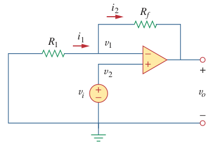

# Non-Inverting Amplifier (Op Amp)

> A ***non-inverting amplifier*** is an [op amp](bd63e87b.md) circuit designed to provide a positive voltage gain.

The input voltage $v_i$ is applied directly at the non-inverting input terminal, and resistor $R_1$ is connected between the ground and the inverting terminal.

> Application of KCL at the inverting terminal gives
>
> $\displaystyle i_1 = i_2 \to \frac{0 - v_1}{R_1} = \frac{v_1 - v_o}{R_f}$
>
> But $v_1 = v_2 = v_i$ for an [ideal op amp](fc89a5a0.md). Hence,
>
> $\displaystyle -\frac{v_i}{R_1} = \frac{v_i - v_o}{R_f}$
>
> $\displaystyle \boxed{v_o = \left(1 + \frac{R_f}{R_1}\right) v_i}$
>
> [Closed-loop voltage gain](6e0eb346.md) $A_v$
>
> $\boxed{A_v = \frac{v_o}{v_i} = 1 + \frac{R_f}{R_1}}$

If feedback resistor $R_f = 0$ (short circuit) or $R_1 = \infty$ (open circuit) or both, the gain becomes 1. This is called a *[voltage follower](dc4db14e.md)* (or *unity gain amplifier*) because the output follows the input.
