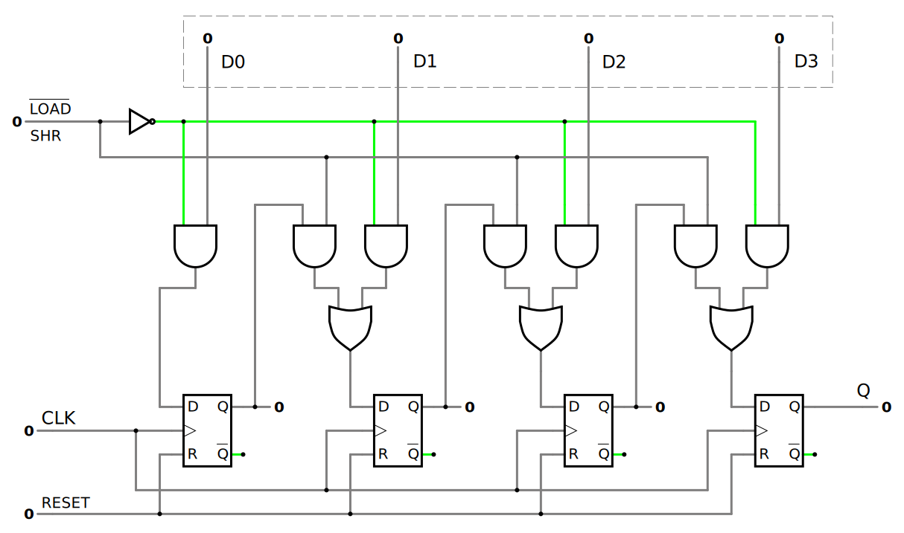

# Registers

> A ***register*** is a group of [flip-flops](16847013.md), each one of which shares a common [clock](8a2342ad.md) and is capable of storing one bit of information. An $n$-bit register consists of a group of $n$ flip-flops capable of storing $n$ bits of binary information.

In its broadest definition, a register consists of a group of flip-flops together with [gates](afcc79cf.md) that affect their operation. The flip-flops hold the binary information, and the gates determine how the information is transferred into the register.

A [counter](f8d9b76c.md) is essentially a register that goes through a predetermined sequence of binary states. The gates in the counter are connected in such a way as to produce the prescribed sequence of states.

## Shift Register

> A register capable of shifting the binary information held in each cell to its neighboring cell, in a selected direction, is called a ***shift register***.

The logical configuration of a shift register consists of a chain of [flip-flops](16847013.md) in cascade, with the output of one flip-flop connected to the data input of the next flip-flop. All flip-flops receive common clock pulses, which activate the shift of data from one stage to the next.

> The datapath of a digital system is said to operate in ***serial mode*** when information is transferred and manipulated one bit at a time. In the ***parallel mode***, information is available from all bits of a register and all bits can be transferred simultaneously during one clock pulse.

Shift registers can have both parallel and serial inputs and outputs. These are often configured as ***SIPO*** (serial-in/parallel-out), or as ***PISO*** (parallel-in/serial-out). There are also types that have both serial and parallel input and types with serial and parallel output. A ***PIPO*** (parallel-in/parallel-out) register is simply a [D-type](16847013.md) register.

### Serial-In Serial-Out (SISO)

The serial-in/serial-out shift register accepts data serially (one bit at a time on a single line). It produces the stored information on its output also in serial form. The data string is presented at $D$ input and is shifted right ($SHR$ input is high) one stage when the clock edge arrives. At each advance, the bit on the $D$ input is shifted into the first [flip-flop](16847013.md) output. The bit on the $Q$ output is shifted out and lost.

This arrangement is the hardware equivalent of a ***queue***. SISO shift registers can be used as simple delay circuits.

### Serial-In Parallel-Out (SIPO)

This configuration allows conversion from serial to parallel format. Data bits are entered serially into a serial-in/parallel-out shift register in the same manner as in serial-in/serial-out (SISO) registers. The difference is the way which the data bits are taken out of the register; in the parallel output register, the output of each stage is available. Once the data are stored, each bit appears on its respective output line ($\mathrm{Q0}$, $\mathrm{Q1}$, $\mathrm{Q2}$, and $\mathrm{Q3}$), and all bits are available simultaneously, rather than on a bit-by-bit basis as with the serial output.

For more outputs, SIPO shift registers are used. The parallel outputs of the shift register and the desired state for all those devices can be sent out of the microcontroller using a single serial connection.

### Parallel-In Serial-Out (PISO)

For a register with parallel data inputs, the bits are entered simultaneously into their respective stages on parallel lines rather than on a bit-by-bit basis on one line as with serial data inputs. The serial output is the same as in serial-in/serial-out (SISO) shift registers, once the data are completely stored in the register.

This configuration has the data input on lines $\mathrm{D0}$ through $\mathrm{D3}$ in parallel format, $\mathrm{D0}$ being the most significant bit. To write the data to the register, the $\overline{LOAD}$ control line must be held LOW with the next clock pulse. To shift the data, the $SHR$ (shift-right) control line is brought HIGH with the next clock pulse. This configuration allows conversion from parallel to serial format.

For more inputs, PISO shift registers are used. Each binary input (such as a button) is attached to a parallel input of the shift register, then the data is sent back serially to the microcontroller.

### Parallel-In Parallel-Out (PIPO)

The data can be loaded into the parallel input lines $\mathrm{D0}$ through $\mathrm{D3}$, $\mathrm{D0}$ being the most significant bit. Once the data is loaded, it can be read out simultaneously on parallel output lines $\mathrm{Q0}$ through $\mathrm{Q3}$, $\mathrm{Q0}$ being the most significant bit. The $LOAD$ input to the register determines the action to be taken with each clock pulse. When the $LOAD$ input is $1$, the data on parallel input lines are transferred into the register with the next clock pulse. When the $LOAD$ input is $0$, the outputs of the [flip-flops](16847013.md) are connected to their respective inputs. The transfer of information from the data inputs or the outputs of the register is done simultaneously in response to a clock edge.

The PIPO shift register is used as a temporary storage device and like SISO shift register it acts as a delay element.

## SIPO-PIPO Shift Register

This configuration is a SIPO shift register with parallel-load capabilities. When $LOAD$ is LOW and $SHR$ (shift-right) is HIGH, the circuit acts like a SIPO shift register with $D$ as serial input. When $LOAD$ is HIGH and $SHR$ is LOW, the circuits acts like a PIPO shift register with parallel input lines $\mathrm{D0}$ through $\mathrm{D3}$. Having $LOAD$ and $SHR$ simultaneously HIGH is forbidden because it's impossible to do both operations on a single clock edge.

## Bidirectional Shift Register

A bidirectional shift register is one in which the data can be shifted either left or right. It can be implemented by using gating logic that enables the transfer of a data bit from one stage to the next stage to the right or to the left, depending on the level of a control line, $SHR$ for shift-right and $\overline{SHL}$ for shift-left. A HIGH on the $SHR$ control input allows data bits inside the register to be shifted to the right, and a $LOW$ on $\overline{SHL}$ enables data bits inside the register to be shifted to the left.

Several bidirectional shift registers can also be connected in parallel for a hardware implementation of ***stack*** (*push* and *pop* operations).

## Universal Shift Register

A register capable of shifting in one direction only is a ***unidirectional*** shift register. One that can shift in both directions is a ***bidirectional*** shift register. If the register can shift in both directions and has parallel-load capabilities, it is referred to as a ***universal shift register***.

| $\mathrm{S0}$ | $\mathrm{S1}$ | $\textrm{Register Operation}$
| :- | :- | :- |
| $0$ | $0$ | $\textit{no change}$ |
| $0$ | $1$ | $\textit{shift left}$ |
| $1$ | $0$ | $\textit{shift right}$ |
| $1$ | $1$ | $\textit{parallel load}$ |

The circuit consists of four $D$ [flip-flops](16847013.md) and four [multiplexers](4f03e6fe.md). The four multiplexers have two common selection inputs $\mathrm{S0}$ and $\mathrm{S1}$. The selection inputs control the mode of operation of the register. When $\mathrm{S0} = 0$ and $\mathrm{S1} = 0$, the present value of the register is applied to the $D$ inputs of the flip-flops. This condition forms a path from the output of each flip-flop into the input of the same flip-flop so that the output *recirculates* to the input in this mode of operation, creating the effect of a suspended clock. When $\mathrm{S0} = 0$ and $\mathrm{S1} = 1$, a shift-left operation results, with the serial input transferred from $DL$ input into $\mathrm{Q3}$ output. When $\mathrm{S0} = 1$ and $\mathrm{S1} = 0$, a shift-right operation results, with the serial input transferred from $DR$ input into $\mathrm{Q0}$ output. Finally, when $\mathrm{S0} = 1$ and $\mathrm{S1} = 1$, the binary information on the parallel input lines $\mathrm{D0}$ through $\mathrm{D3}$ is transferred into the register simultaneously during the next clock edge.

