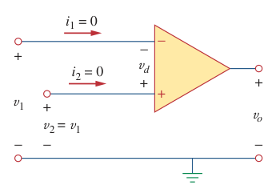

# Ideal Op Amp

An [op amp](bd63e87b.md) is ideal if it has the following characteristics:

1. Infinite [open-loop gain](7180590d.md), $A \simeq \infty$.
2. Infinite input resistance, $R_{i} \simeq \infty\,\Omega$.
3. Zero output resistance, $R_{o} \simeq 0\,\Omega$.

> An ***ideal op amp*** is an amplifier with infinite open-loop gain, infinite input resistance, and zero output resistance.

Two important characteristics of the ideal op amp are:

1. *The currents into both input terminals are zero.*

    > $\boxed{i_{1} = i_{2} = 0}$

    This is due to infinite input resistance. An infinite resistance between the input terminals that an open circuit exists there and current cannot enter the op amp.

2. *The voltage across the input terminals is equal to zero.*

    > $\displaystyle v_{d} = v_{2} - v_{1} = 0$
    >
    > $\boxed{v_{1} = v_{2}}$

    When *[negative feedback](6e0eb346.md)* is added to an op amp, *the input terminals become identical*. Meaning, whatever is the voltage present in the non-inverting input is also present in the inverting input.

> The two characteristics can be exploited by noting that for voltage calculations the input port behaves as a short circuit, while for current calculations the input port behaves as an open circuit.
